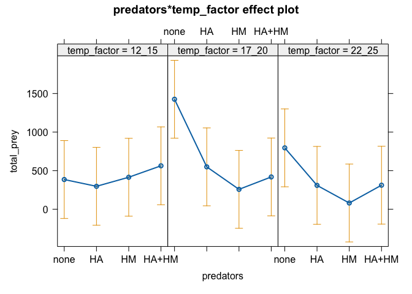
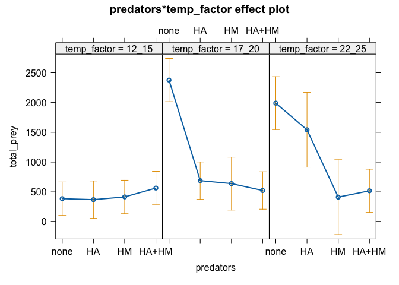
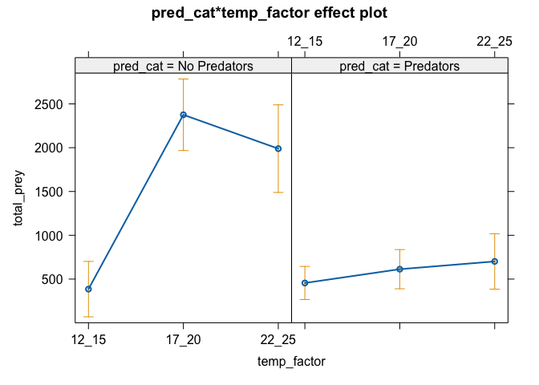

HW 7 - Temperature effect on predators
================
Keanu Rochette
2025-03-08

- [Load libraries](#load-libraries)
- [Load the data](#load-the-data)
  - [Data clean-up](#data-clean-up)
- [Question 1](#question-1)
  - [Likehood ratio](#likehood-ratio)
  - [Testing the parameters
    individually](#testing-the-parameters-individually)
  - [Answer Q1](#answer-q1)
- [Question 2](#question-2)
  - [Testing the interaction](#testing-the-interaction)
  - [Testing individual variable](#testing-individual-variable)
  - [Answer Q2](#answer-q2)
- [Question 3](#question-3)
  - [Renaming the columns](#renaming-the-columns)
  - [Reduced model](#reduced-model)
  - [Testing individual variable](#testing-individual-variable-1)
  - [Answer Q3](#answer-q3)
- [Question 4](#question-4)
  - [Testing the interaction](#testing-the-interaction-1)
  - [Testing individual variables](#testing-individual-variables)
  - [Best fit model](#best-fit-model)
  - [Answer Q4](#answer-q4)

## Load libraries

``` r
# Data manipulation and visualization 
library(tidyverse)
library(here)
library(janitor)
library(gt)
library(gtExtras)

# Data analysis/statistics 
library(glmmTMB)
```

    ## Warning in check_dep_version(dep_pkg = "TMB"): package version mismatch: 
    ## glmmTMB was built with TMB package version 1.9.15
    ## Current TMB package version is 1.9.16
    ## Please re-install glmmTMB from source or restore original 'TMB' package (see '?reinstalling' for more information)

``` r
library(car) #ANOVA
library(ggeffects)
library(effects) #dependency for ggeffects
#library(arm) #discrete.histogram() function
#library(MASS) #required for arm package
```

## Load the data

``` r
bug <- read_csv(here("HW7","data","collembola_2025.csv"))
```

### Data clean-up

``` r
bug<- bug %>% clean_names() %>% 
  mutate(predators = factor(predators, levels = c("none", "HA", "HM", "HA+HM")))
```

## Question 1

1.  *First use an appropriate ‘standard’ model for counts (i.e., not
    zero-inflated) to ask whether the abundance of Collembola is
    affected by temperature, by the presence of one or more predators,
    and whether the effect of predators depends on temperature. Use the
    function glmmTMB() to fit the model, because later we will compare
    this model to others fit with this function. Plot fitted effects and
    perform likelihood ratio tests on the relevant terms.*

2.  *To perform marginal tests you will want to compare pairs of models
    using the function anova(). Previously we used the function Anova()
    (the capitalized and uncapitalized functions are different) to
    automate this process, but this function returns a less accurate
    test for glmmTMB (a Wald test). So, for each term you want to test,
    compare a model with this term to a model without this term. How do
    you interpret the results at this stage?*

``` r
# setting up the full model and the reduced model, missing the interaction term
Q1_full <- glmmTMB(total_prey~predators*temp_factor, data = bug)
```

``` r
#Visualizing the effects plots of full and reduced models.
plot(allEffects(Q1_full))
```

<!-- -->

### Likehood ratio

``` r
Q1_reduced <- glmmTMB(total_prey~predators + temp_factor, data = bug)
```

``` r
# comparing the models with the anova() function
## p = 0.3, the interaction is not significant 
anova(Q1_full,Q1_reduced)
```

    ## Data: bug
    ## Models:
    ## Q1_reduced: total_prey ~ predators + temp_factor, zi=~0, disp=~1
    ## Q1_full: total_prey ~ predators * temp_factor, zi=~0, disp=~1
    ##            Df    AIC    BIC  logLik deviance  Chisq Chi Df Pr(>Chisq)
    ## Q1_reduced  7 951.08 965.74 -468.54   937.08                         
    ## Q1_full    13 955.88 983.10 -464.94   929.88 7.2061      6     0.3022

### Testing the parameters individually

#### Predators

``` r
Q1_predators <- glmmTMB(total_prey~predators, data = bug)
```

``` r
## p = 0.26
anova(Q1_reduced, Q1_predators)
```

    ## Data: bug
    ## Models:
    ## Q1_predators: total_prey ~ predators, zi=~0, disp=~1
    ## Q1_reduced: total_prey ~ predators + temp_factor, zi=~0, disp=~1
    ##              Df    AIC    BIC  logLik deviance  Chisq Chi Df Pr(>Chisq)
    ## Q1_predators  5 949.77 960.24 -469.88   939.77                         
    ## Q1_reduced    7 951.08 965.74 -468.54   937.08 2.6859      2     0.2611

#### Temperature (factors)

``` r
Q1_temp <- glmmTMB(total_prey~temp_factor, data = bug)
```

``` r
## p = 0.03 (p < 0.05)
anova(Q1_reduced, Q1_temp)
```

    ## Data: bug
    ## Models:
    ## Q1_temp: total_prey ~ temp_factor, zi=~0, disp=~1
    ## Q1_reduced: total_prey ~ predators + temp_factor, zi=~0, disp=~1
    ##            Df    AIC    BIC  logLik deviance  Chisq Chi Df Pr(>Chisq)  
    ## Q1_temp     4 953.53 961.91 -472.77   945.53                           
    ## Q1_reduced  7 951.08 965.74 -468.54   937.08 8.4521      3    0.03754 *
    ## ---
    ## Signif. codes:  0 '***' 0.001 '**' 0.01 '*' 0.05 '.' 0.1 ' ' 1

### Answer Q1

- Comparing the full vs the reduced model: The interaction between the
  predators and the temperature was not significant. That means that the
  effect of the predator on the Collembola is not dependent on
  temperature.

- Comparing the predator alone: The likehood ratio between the reduced
  model and model only accounting for the predators was not significant,
  which means that the predator communities did not have a significant
  effect on the total number of Collembola in the mesocosm.

- Comparing the temperature effect: The likehood ratio between the
  reduced model and model only accounting for the temperature was
  significant, which means that the temperature regimes had a
  significant effect on the total number of Collembola in the mesocosm.

## Question 2

*A large proportion of the data are zeros, and it may be the case that
processes controlling abundance are different from processes controlling
‘extra’ zeros – if, in fact, there are extra zeros. *

1.  *Use glmmTMB to fit zero-inflated count model(s). You should decide
    how many to fit, and which kind of probability distribution(s) to
    use. *
2.  *Use AIC to do model selection, to determine whether incorporating
    zero inflation improves model fit.*
3.  *Using the best model (i.e., the lowest AIC), perform marginal
    likelihood ratio tests on the predictors, again using anova() to
    compare pairs of models. How have the results changed from \#1?*

``` r
zi_full <- glmmTMB(total_prey~predators*temp_factor, ziformula =~ 1, # zero inflated formula
                 data = bug)
zi_nb <- glmmTMB(total_prey~predators*temp_factor, ziformula =~ 1, # zero inflated formula
                 data = bug, family = 'nbinom2')
zi_poisson <- glmmTMB(total_prey~predators, ziformula =~ 1, # zero inflated formula
        data = bug, family = 'poisson')
```

``` r
## It looks like the zero inflated model without specifying a family of function has the smallest AIC number
anova(Q1_full, zi_full, zi_nb, zi_poisson)
```

    ## Data: bug
    ## Models:
    ## zi_poisson: total_prey ~ predators, zi=~1, disp=~1
    ## Q1_full: total_prey ~ predators * temp_factor, zi=~0, disp=~1
    ## zi_full: total_prey ~ predators * temp_factor, zi=~1, disp=~1
    ## zi_nb: total_prey ~ predators * temp_factor, zi=~1, disp=~1
    ##            Df     AIC     BIC  logLik deviance    Chisq Chi Df Pr(>Chisq)    
    ## zi_poisson  5 15323.8 15334.3 -7656.9  15313.8                               
    ## Q1_full    13   955.9   983.1  -464.9    929.9 14383.92      8     <2e-16 ***
    ## zi_full    14   664.3   693.7  -318.2    636.3   293.54      1     <2e-16 ***
    ## zi_nb      14   673.6   702.9  -322.8    645.6     0.00      0          1    
    ## ---
    ## Signif. codes:  0 '***' 0.001 '**' 0.01 '*' 0.05 '.' 0.1 ' ' 1

``` r
plot(allEffects(zi_full))
```

<!-- -->

### Testing the interaction

``` r
zi_reduced <- glmmTMB(total_prey~predators+temp_factor, ziformula =~ 1, data = bug)
```

``` r
# p < 0.05
anova(zi_full, zi_reduced)
```

    ## Data: bug
    ## Models:
    ## zi_reduced: total_prey ~ predators + temp_factor, zi=~1, disp=~1
    ## zi_full: total_prey ~ predators * temp_factor, zi=~1, disp=~1
    ##            Df    AIC    BIC  logLik deviance  Chisq Chi Df Pr(>Chisq)    
    ## zi_reduced  8 690.21 706.96 -337.11   674.21                             
    ## zi_full    14 664.34 693.66 -318.17   636.34 37.874      6  1.189e-06 ***
    ## ---
    ## Signif. codes:  0 '***' 0.001 '**' 0.01 '*' 0.05 '.' 0.1 ' ' 1

### Testing individual variable

#### Predators

``` r
zi_pred <- glmmTMB(total_prey~predators, ziformula =~ 1, data = bug)
```

``` r
# p < 0.05
anova(zi_reduced, zi_pred)
```

    ## Data: bug
    ## Models:
    ## zi_pred: total_prey ~ predators, zi=~1, disp=~1
    ## zi_reduced: total_prey ~ predators + temp_factor, zi=~1, disp=~1
    ##            Df    AIC    BIC  logLik deviance  Chisq Chi Df Pr(>Chisq)   
    ## zi_pred     6 698.09 710.66 -343.05   686.09                            
    ## zi_reduced  8 690.21 706.96 -337.11   674.21 11.884      2   0.002627 **
    ## ---
    ## Signif. codes:  0 '***' 0.001 '**' 0.01 '*' 0.05 '.' 0.1 ' ' 1

#### Temperature

``` r
zi_temp <- glmmTMB(total_prey~temp_factor, ziformula =~ 1, data = bug)
```

``` r
# p < 0.05
anova(zi_reduced, zi_temp)
```

    ## Data: bug
    ## Models:
    ## zi_temp: total_prey ~ temp_factor, zi=~1, disp=~1
    ## zi_reduced: total_prey ~ predators + temp_factor, zi=~1, disp=~1
    ##            Df    AIC    BIC  logLik deviance  Chisq Chi Df Pr(>Chisq)   
    ## zi_temp     5 698.33 708.81 -344.17   688.33                            
    ## zi_reduced  8 690.21 706.96 -337.11   674.21 14.125      3    0.00274 **
    ## ---
    ## Signif. codes:  0 '***' 0.001 '**' 0.01 '*' 0.05 '.' 0.1 ' ' 1

### Answer Q2

- Interaction: The interaction is significant. The magnitude of the
  predator effect on the Collembole is temperature dependent, which was
  not detected in Q1 when zero inflation was not accounted for.
- Predator: The predator effect is significant. So, the presence of
  predator changes the number of Collembole in a mesocosm when
  accounting for zero inflation.
- Temperature: Temperature affects significantly the population of
  preys. However, the magnitude of the effect is more significant than
  in Q1 when zero inflation was not accounted for.

## Question 3

### Renaming the columns

``` r
bug <- bug %>% mutate(pred_cat = ifelse(predators == "none", "No Predators", "Predators")) %>% 
  relocate(pred_cat, .after = "predators")
```

``` r
Q3_zi_full <- glmmTMB(total_prey~pred_cat*temp_factor, ziformula =~ 1, data = bug)
```

``` r
plot(allEffects(Q3_zi_full))
```

<!-- -->

### Reduced model

``` r
Q3_zi_reduced <- glmmTMB(total_prey~pred_cat + temp_factor, ziformula =~ 1, data = bug)
```

``` r
#p < 0.05
anova(Q3_zi_full, Q3_zi_reduced)
```

    ## Data: bug
    ## Models:
    ## Q3_zi_reduced: total_prey ~ pred_cat + temp_factor, zi=~1, disp=~1
    ## Q3_zi_full: total_prey ~ pred_cat * temp_factor, zi=~1, disp=~1
    ##               Df    AIC    BIC  logLik deviance  Chisq Chi Df Pr(>Chisq)    
    ## Q3_zi_reduced  6 686.51 699.08 -337.25   674.51                             
    ## Q3_zi_full     8 661.88 678.64 -322.94   645.88 28.628      2  6.074e-07 ***
    ## ---
    ## Signif. codes:  0 '***' 0.001 '**' 0.01 '*' 0.05 '.' 0.1 ' ' 1

### Testing individual variable

#### Predators

``` r
Q3_zi_pred <- glmmTMB(total_prey~pred_cat, ziformula =~ 1, data = bug)
```

``` r
# p < 0.05
anova(Q3_zi_full, Q3_zi_pred)
```

    ## Data: bug
    ## Models:
    ## Q3_zi_pred: total_prey ~ pred_cat, zi=~1, disp=~1
    ## Q3_zi_full: total_prey ~ pred_cat * temp_factor, zi=~1, disp=~1
    ##            Df    AIC    BIC  logLik deviance  Chisq Chi Df Pr(>Chisq)    
    ## Q3_zi_pred  4 694.46 702.84 -343.23   686.46                             
    ## Q3_zi_full  8 661.88 678.64 -322.94   645.88 40.578      4  3.286e-08 ***
    ## ---
    ## Signif. codes:  0 '***' 0.001 '**' 0.01 '*' 0.05 '.' 0.1 ' ' 1

#### Temperature

``` r
Q3_zi_temp <- glmmTMB(total_prey~temp_factor, ziformula =~ 1, data = bug)
```

``` r
# p < 0.05
anova(Q3_zi_full, Q3_zi_temp)
```

    ## Data: bug
    ## Models:
    ## Q3_zi_temp: total_prey ~ temp_factor, zi=~1, disp=~1
    ## Q3_zi_full: total_prey ~ pred_cat * temp_factor, zi=~1, disp=~1
    ##            Df    AIC    BIC  logLik deviance  Chisq Chi Df Pr(>Chisq)    
    ## Q3_zi_temp  5 698.33 708.81 -344.17   688.33                             
    ## Q3_zi_full  8 661.88 678.64 -322.94   645.88 42.453      3  3.215e-09 ***
    ## ---
    ## Signif. codes:  0 '***' 0.001 '**' 0.01 '*' 0.05 '.' 0.1 ' ' 1

### Answer Q3

- Interaction: The result is similar to Q2. The effect of predator is
  dependent on temperature and the effect of the interaction is
  significant.
- Predator: The predator effect is significant. The presence of predator
  changes the number of Collembole in a mesocosm. However, as we saw
  previously, the community composition of predators does not have a
  significant effect on the preys, but the presence of predators as a
  whole affects the prey population.
- Temperature:the effect is comparable to Q2. Significant effect of
  temperature on the prey count.

## Question 4

``` r
Q4_full <- glmmTMB(total_prey ~ temp_factor * predators, 
                       ziformula = ~ 1, 
                       data = bug) 

Q4_reduced <- glmmTMB(total_prey ~ temp_factor * predators, 
                       ziformula = ~ temp_factor+predators, # let zeros vary with temp and predators
                       data = bug) 

Q4_pred <- glmmTMB(total_prey ~ temp_factor * predators, 
                       ziformula = ~ predators, # let zeros very with predators only
                       data = bug) 

Q4_temp <- glmmTMB(total_prey ~ temp_factor * predators, 
                       ziformula = ~ temp_factor,  # let zeros very with temperature only
                       data = bug) 
```

### Testing the interaction

``` r
# p< 0.05
anova(Q4_full, Q4_reduced)
```

    ## Data: bug
    ## Models:
    ## Q4_full: total_prey ~ temp_factor * predators, zi=~1, disp=~1
    ## Q4_reduced: total_prey ~ temp_factor * predators, zi=~temp_factor + predators, disp=~1
    ##            Df    AIC    BIC  logLik deviance  Chisq Chi Df Pr(>Chisq)    
    ## Q4_full    14 664.34 693.66 -318.17   636.34                             
    ## Q4_reduced 19 652.75 692.54 -307.38   614.75 21.585      5  0.0006278 ***
    ## ---
    ## Signif. codes:  0 '***' 0.001 '**' 0.01 '*' 0.05 '.' 0.1 ' ' 1

### Testing individual variables

#### Predators

``` r
# p< 0.05
anova(Q4_reduced, Q4_pred)
```

    ## Data: bug
    ## Models:
    ## Q4_pred: total_prey ~ temp_factor * predators, zi=~predators, disp=~1
    ## Q4_reduced: total_prey ~ temp_factor * predators, zi=~temp_factor + predators, disp=~1
    ##            Df    AIC    BIC  logLik deviance  Chisq Chi Df Pr(>Chisq)    
    ## Q4_pred    17 667.67 703.27 -316.83   633.67                             
    ## Q4_reduced 19 652.75 692.54 -307.38   614.75 18.917      2  7.803e-05 ***
    ## ---
    ## Signif. codes:  0 '***' 0.001 '**' 0.01 '*' 0.05 '.' 0.1 ' ' 1

#### Temperature

``` r
# p = 0.031
anova(Q4_reduced, Q4_temp)
```

    ## Data: bug
    ## Models:
    ## Q4_temp: total_prey ~ temp_factor * predators, zi=~temp_factor, disp=~1
    ## Q4_reduced: total_prey ~ temp_factor * predators, zi=~temp_factor + predators, disp=~1
    ##            Df    AIC    BIC  logLik deviance  Chisq Chi Df Pr(>Chisq)
    ## Q4_temp    16 650.36 683.87 -309.18   618.36                         
    ## Q4_reduced 19 652.75 692.54 -307.38   614.75 3.6132      3     0.3064

### Best fit model

The best model is Q4_pred where zero values are allowed to vary based on
predator categories.

``` r
summary(Q4_pred)
```

    ##  Family: gaussian  ( identity )
    ## Formula:          total_prey ~ temp_factor * predators
    ## Zero inflation:              ~predators
    ## Data: bug
    ## 
    ##      AIC      BIC   logLik deviance df.resid 
    ##    667.7    703.3   -316.8    633.7       43 
    ## 
    ## 
    ## Dispersion estimate for gaussian family (sigma^2): 9.74e+04 
    ## 
    ## Conditional model:
    ##                                 Estimate Std. Error z value Pr(>|z|)    
    ## (Intercept)                       385.56     139.60   2.762  0.00575 ** 
    ## temp_factor17_20                 1991.16     227.96   8.734  < 2e-16 ***
    ## temp_factor22_25                 1603.68     261.17   6.140 8.23e-10 ***
    ## predatorsHA                       -15.99     209.41  -0.076  0.93913    
    ## predatorsHM                        29.51     197.42   0.149  0.88119    
    ## predatorsHA+HM                    178.12     197.42   0.902  0.36695    
    ## temp_factor17_20:predatorsHA    -1672.07     317.32  -5.269 1.37e-07 ***
    ## temp_factor22_25:predatorsHA     -431.12     435.90  -0.989  0.32265    
    ## temp_factor17_20:predatorsHM    -1767.08     346.73  -5.096 3.46e-07 ***
    ## temp_factor22_25:predatorsHM    -1606.78     430.48  -3.733  0.00019 ***
    ## temp_factor17_20:predatorsHA+HM -2031.73     309.56  -6.563 5.27e-11 ***
    ## temp_factor22_25:predatorsHA+HM -1649.65     346.74  -4.758 1.96e-06 ***
    ## ---
    ## Signif. codes:  0 '***' 0.001 '**' 0.01 '*' 0.05 '.' 0.1 ' ' 1
    ## 
    ## Zero-inflation model:
    ##                Estimate Std. Error z value Pr(>|z|)
    ## (Intercept)     -0.6931     0.5477  -1.266    0.206
    ## predatorsHA      0.2874     0.7602   0.378    0.705
    ## predatorsHM      0.5588     0.7537   0.741    0.458
    ## predatorsHA+HM  -0.6947     0.8472  -0.820    0.412

``` r
summary(zi_full)
```

    ##  Family: gaussian  ( identity )
    ## Formula:          total_prey ~ predators * temp_factor
    ## Zero inflation:              ~1
    ## Data: bug
    ## 
    ##      AIC      BIC   logLik deviance df.resid 
    ##    664.3    693.7   -318.2    636.3       46 
    ## 
    ## 
    ## Dispersion estimate for gaussian family (sigma^2): 9.74e+04 
    ## 
    ## Conditional model:
    ##                                 Estimate Std. Error z value Pr(>|z|)    
    ## (Intercept)                       385.56     139.60   2.762  0.00575 ** 
    ## predatorsHA                       -16.03     209.40  -0.077  0.93897    
    ## predatorsHM                        29.49     197.42   0.149  0.88125    
    ## predatorsHA+HM                    178.15     197.42   0.902  0.36686    
    ## temp_factor17_20                 1991.19     227.96   8.735  < 2e-16 ***
    ## temp_factor22_25                 1603.66     261.16   6.140 8.23e-10 ***
    ## predatorsHA:temp_factor17_20    -1672.04     317.32  -5.269 1.37e-07 ***
    ## predatorsHM:temp_factor17_20    -1767.28     346.76  -5.097 3.46e-07 ***
    ## predatorsHA+HM:temp_factor17_20 -2031.71     309.55  -6.563 5.26e-11 ***
    ## predatorsHA:temp_factor22_25     -431.16     435.90  -0.989  0.32259    
    ## predatorsHM:temp_factor22_25    -1607.12     430.60  -3.732  0.00019 ***
    ## predatorsHA+HM:temp_factor22_25 -1649.46     346.69  -4.758 1.96e-06 ***
    ## ---
    ## Signif. codes:  0 '***' 0.001 '**' 0.01 '*' 0.05 '.' 0.1 ' ' 1
    ## 
    ## Zero-inflation model:
    ##             Estimate Std. Error z value Pr(>|z|)  
    ## (Intercept)  -0.6196     0.2708  -2.288   0.0221 *
    ## ---
    ## Signif. codes:  0 '***' 0.001 '**' 0.01 '*' 0.05 '.' 0.1 ' ' 1

### Answer Q4

- Zeros are more likely to be inflated with predators HA and HM because
  their coefficient are positive
- Zeros are less likely to be inflated with predators HA+HM because that
  combination of predators has a coefficient less than zero.
- I’m not sure what the count model is… Sorry.
